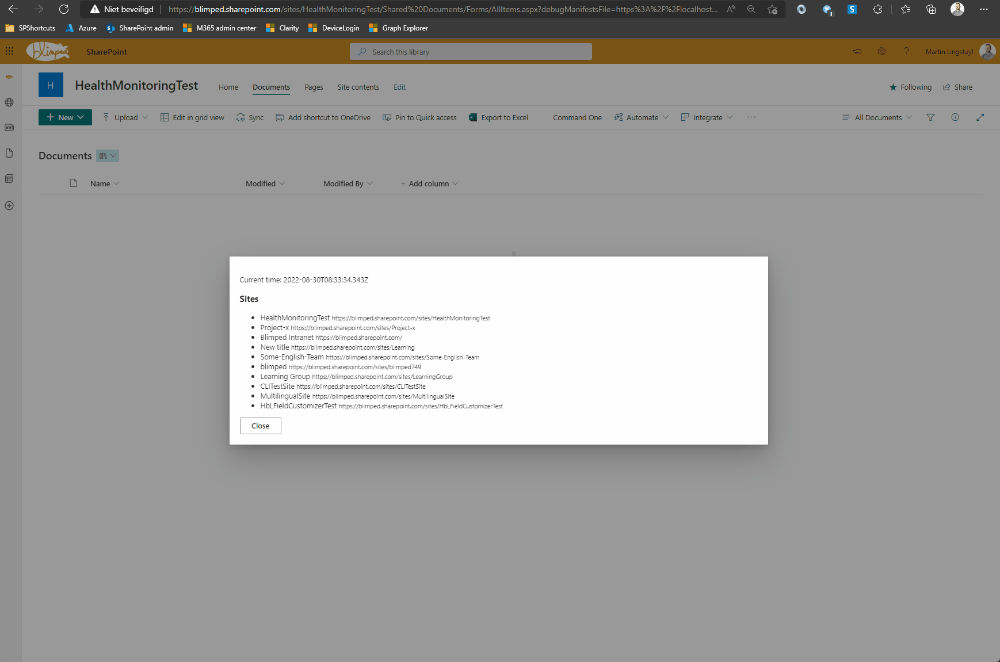

# pnpjs-reqdigest

## Summary
Showcases an exception with an invalid Formdigest in SPFx extensions.

## Reprosteps
1. Run `gulp serve --config helloWorld` and load the SPFx extension on a document library.
2. Click the `command one` command set button. It should show a list of sites
3. Leave the browser open for an hour
4. Click `Close` and click the `Command one` button again. It should still show a list of sites.
5. Now click the refresh button of your browser.
6. Click the command one button again. It now throws a 403.





## Workaround
The workaround is to explicitly add the RequestDigest behavior before the SPFx behavior:

```typescript
this._sp = spfi().using(RequestDigest(), SPFx({ pageContext }));
```

This will force the service to load a new request digest.